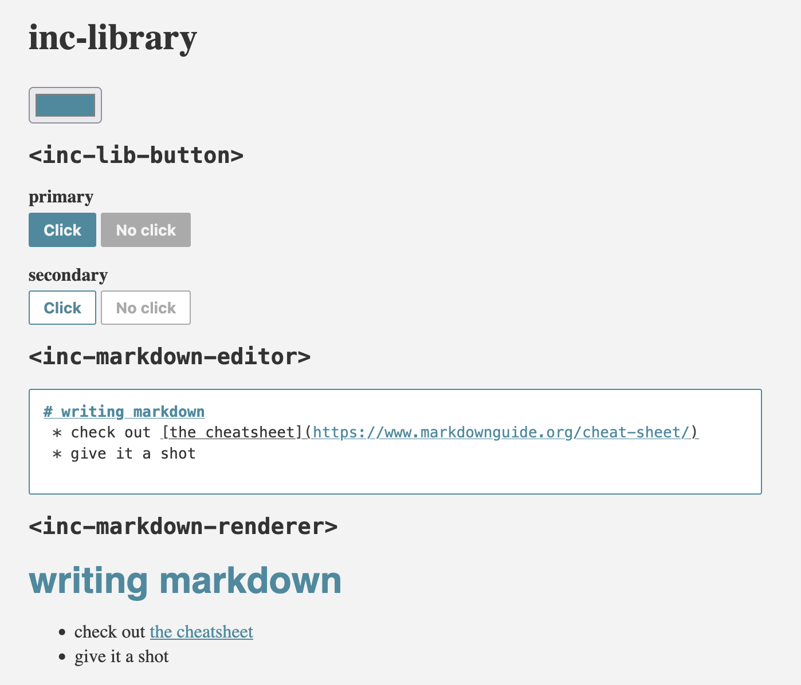

# What?
This is a collection of some generally reusable components made with [@stevvvns/incomponent](https://github.com/stevvvns/incomponent) and usable as native webcomponents in any framework



# How?
```
npm i
npm run build
npm run serve
```

Visit `http://localhost:3000/example.html` to see what is available.

To use components in your own app, install and import from `@stevvvns/inc-library/dist/component-name.js'
